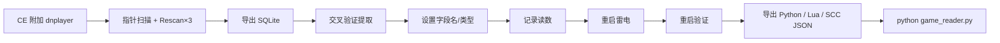

# CE 基址提取器 (ce-base-extractor)

从 **Cheat Engine 指针扫描** 结果一键提取稳定基址，并生成 **Python / Lua 内存读取脚本**。默认针对 **雷电模拟器**（`dnplayer.exe`）优化。

仓库：https://github.com/180024421/ce-base-extractor

## 工作流



## 功能一览（v0.5.3）

| 功能 | 说明 |
|------|------|
| 交叉流式 Top-N | 稳定链不再全量进内存再裁剪 |
| diff fuzzy 对齐 | 与交叉验证默认同口径 |
| PTR 流式提取 | 大 `.PTR` 走 stream_rank |
| 监控缓存失效 | 模拟器重启后自动重连 |
| PTR mmap | `.PTR` 大文件 mmap 流式解析 |
| 键计数 spill | 交叉验证超 20 万键自动 SQLite 落盘 |
| GUI 模块化 | mixin 拆分，便于维护 |
| 交叉验证 fuzzy | 末 offset 容差对齐，3/3 优先 |
| 在线探针 | Top N 可读性验证 + 类型推断 |
| 流式提取 | 大 SQLite 不 OOM，扫描进度显示 |
| Profile 快照 | 记录读数持久化，verify/scc-recheck 可用 |
| Profile 版本化 | 历史版本 + profile-migrate 对比 |
| Lua 导出 | Auto Script Studio 读链模板 |
| SCC v2 | 含 snapshots / probe 元数据 |
| GUI 高级选项 | live_probe、模糊去重、增量交叉监视 |
| CLI | diff / verify / watch / import-scc / profile-migrate / scc-recheck |

## 快速开始

```powershell
cd E:\xiangmu\ce-base-extractor
.\安装环境.cmd
.\一键启动.cmd
```

### 命令行

```powershell
# 交叉验证 + 全量导出
.\.venv\Scripts\python -m ce_base_extractor r1.sqlite --cross r2.sqlite r3.sqlite `
  --format all --game mygame -o ./mygame_export

# 增量交叉监视
.\.venv\Scripts\python -m ce_base_extractor watch --auto-extract --incremental-cross

# Profile 迁移对比
.\.venv\Scripts\python -m ce_base_extractor profile-migrate --profile mygame new.sqlite

# 重启验证（使用 Profile 快照）
.\.venv\Scripts\python -m ce_base_extractor verify --profile mygame --require-value-match

# SCC 定时复检
.\.venv\Scripts\python -m ce_base_extractor scc-recheck --profile mygame
```

## 开发

```powershell
pip install -r requirements-dev.txt
pytest tests -q --cov=ce_base_extractor
ruff check .
ruff format --check .
```

Agent 指南见 [AGENTS.md](AGENTS.md)

## 许可

MIT · 仅供学习与研究。请遵守游戏服务条款与当地法律法规。
